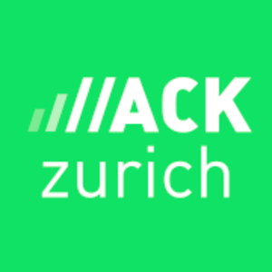

  
  

 

<h1 align="center"> Remote Forecaster</h1>

<h3 align="center"> Powered by PASS </h3>

<h4 align="center">Live demo: <a href="https://remoteforecaster-hz2022.vercel.app/">https://remoteforecaster-hz2022.vercel.app/</a></h4>

 

# Motivation
In a world beyond the verge of the change, where more and more people are starting working from all around, we need
to be aware of the impact of such a choice. Not only on our social sphere, but also on 
the environment and our own health. Why do we need to know that? Because only through conscious decisions
one can shape their behaviour and change their lives, their society and, ultimately, the environment. For the better.

Remote Forecaster helps you to understand the impact of going to the office or not, depending on your habits, 
meteorological situation and office air quality conditions. Improve your decisions, by being aware of what they are producing.

# Architecture

  

## Model Development
The model is giving you a percentage of how likely you should go to the office depending on the social interaction possibility.
Percentage is computed from the backend from the model's prediction: the level of CO2 inside the office, 
based on the outside weather situation and the inside air quality conditions.
The features taken into account come from the following data sources:
- [Democratize Air Quality - Sensirion](https://sensirion.com/career/career-news/hack-zurich/)
- [Stündlich aktualisierte Meteodaten - Open Data Swiss](https://opendata.swiss/en/dataset/stundlich-aktualisierte-meteodaten-seit-1992)

## The tech behind it all
### Backend
- We wanted to use all the datasets available to us, but because of limitation of time, we had to narrow the scope to identify what we want to achieve and how we can optimally do it
- We used the power of Machine learning to make valuable predictions from air quality, climate and energy datasets to conserve resources.
- We realised that only one dataset on its own is not enough to enable us to make valuable predictions. We had to combine multiple open datasets, as well as gather real time weather results in order to achieve meaningful predictions.
- We gather data from [Sensirion](https://sensirion.com/career/career-news/hack-zurich/), [opendata.swiss](https://opendata.swiss/) and [OpenWeatherApi](https://openweathermap.org/current) to feed our Machine Learning algorithm, and identify how to make an optimised decision in a constrained environment.
- We hosted the machine learning model in Google cloud using dockerized FastAPI service, which was used to take data from different sources, preprocess it, and infer the prediction for user regarding feasibility for working from home or going to the office, along with sharing the energy impact of his choices on the environment.
- We dockerized the application so that it could be deployed easily and deterministically using any cloud service or provider.

### Frontend

  
  
  

- As an app aimed at giving to the user quick and efficient information, we wanted to work on a technology optimized for Mobile. React with Next.js provided a fast and easy way to showcase our app's main feature. In combination with Tailwind CSS, we were able to render easily a visually appealing webapp.
